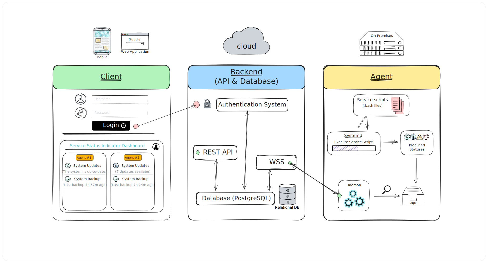

# Service Status Indicator — Blueprint

## Purpose

This document is the high-level blueprint for **Service Status Indicator (SSI)** — a monitoring system for Linux servers composed of three primary components: **Client (Dashboard/Frontend)**, **Agent** (runs on monitored hosts), and **Backend (Server/API & Database)**. The goal of this blueprint is to capture architecture, data flows, responsibilities, technology choices, and an actionable roadmap so implementation can follow smoothly.

---

# 1. Goals & Non-Goals

## Goals

- **Convention-driven monitoring system** — SSI is not about implementing its own health checks. Instead, it provides a framework: administrators write **service-scripts** following clear conventions (metadata, constants, schedule, etc.). SSI takes care of orchestration (scheduling, execution, status collection, reporting to Backend, displaying to the Client).

- **Standardized service scripts** — All checks are encapsulated as scripts (Bash). Each script declares its name, description, version, schedule, timeout, and constants. This ensures consistency and interoperability across environments.

- **Normalized statuses** — SSI enforces a common set of status codes (`OK`, `UPDATE`, `WARNING`, `FAILURE`). This opens the way for a dashboard and a notifications system that can be consistent, regardless of what each script does internally.

  _Note: We intentionally use `FAILURE` instead of `ERROR`. `FAILURE` communicates that a monitored service or check has definitively failed its intended condition (e.g., service down, critical problem). `ERROR` could be confused with a runtime or scripting issue. In SSI semantics:_

  - `OK` → Everything is healthy.
  - `UPDATE` → Action needed, but not broken (e.g., updates available).
  - `WARNING` → Degraded or risky condition.
  - `FAILURE` → Critical failure of the monitored service.
  - `ERROR` → Script execution problems (e.g., bad permissions, syntax error) are considered Agent/logging issues, not status outputs.\*

- **Automated scheduling and execution** — The Agent creates and manages **systemd services and timers** for each **service-script**. This leverages the OS’s native scheduling and supervision rather than reinventing it.

- **Result transmission** — The Agent sends script results (status + metadata) to the central Backend.

- **User-facing Client (Dashboard)** — Clients primarily serve as read-only dashboards. Users can authenticate, register their servers, and view service statuses. The Client abstracts away monitoring complexity and provides a unified place to observe statuses across many servers, with push notifications when things change.

  _Note: The management of the **service-scripts** is done directly on the host via the Agent’s CLI tool, not through the Client._

- **Notifications** _(Feature)_ — When a status changes (e.g., from OK → UPDATE or WARNING → FAILURE), the system can notify users via the Client.

- **Component-oriented architecture** — The Agent, Backend, and Client are decoupled and can evolve independently. For example, a new Client (mobile app) could be added without changing the Agent.

## Non-Goals (initial)

- **No new scripting language** — SSI will not invent a custom DSL. The system relies on existing scripting capabilities of `Bash`, with SSI conventions layered on top.

- **Not a full metrics/analytics platform** — SSI does not aim to be Prometheus or InfluxDB. Long-term time-series storage and analytics may be added later, but MVP focuses on current/last-known status.

- **No enterprise bells and whistles in v1** — Multi-tenant billing, single sign-on, role-based access control, and similar enterprise features are explicitly out of scope for the first iteration.

---

# 2. High-level Overview

A single-paragraph summary and a placeholder for the high-level diagram.

**Summary:** Agents run on Linux servers that you want to monitor, and they manage the execution of user-provided **service scripts**. Each script produces standardized outputs (`OK`, `UPDATE`, `WARNING`, `FAILURE`) with timestamps and optional descriptive text messages (e.g., `"2025-09-02 16:06:37, OK, System is up-to-date."`). The Agent collects these outputs and pushes them to the Backend. The Backend stores the latest known state of each service and makes it accessible to the Client Dashboard, where users can track health, updates, failures, etc.



---

# 3. Components

## 3.1 Client (Dashboard / Frontend)

**Responsibility:** Presents UI for users to sign up/login, register servers, and view statuses.

**Features (MVP):**

- Login / Sign-up (email + password)
- Dashboard overview (list of registered servers and statuses)
- Server detail view
- Service detail view

**Features:**

- Single sign-on or social OAuth
- Push Notifications

### Android/iOS Client

**Tech stack:** The Android and iOS clients will be implemented using **React Native/Expo SDK**.

### Desktop Universal Client

**Tech stack:** Desktop clients will be implemented using **Electron**.

### Web client

**Tech stack:** The Web client will be am MVP solution directly from Django back-end using vanilla JavaScript but React.js could be used if simplifies the codebase.

---

## 3.2 Agent

**Responsibility:** Run on a user's Linux server to manage the user-provided service scripts and there execution, enforce scheduling conventions, and reliably send results to the Backend.

**Naming:** Use the term **Agent** (industry-standard). Avoid naming collisions with “Client”.

**MVP responsibilities:** The Agent's responsibilities and functionality is split up into 3 components.

- Provide a convention-driven environment (constants, logging, error handling) so user scripts remain simple.

### Utilization of systemd

- The Agent executes SSI **service-scripts** using `.service` and `.timer` units.

  - SSI managed services follow naming and placement conventions. For example, here is a service script for checking if the Debian system is up-to-date:

    <details>
    <summary>
      View script: <code>check-system-updates.bash</code>
    </summary>

    ```bash
    #!/bin/bash

    # name: System Updates
    # description: Checking for system updates on Debian/Ubuntu
    # version: 1.0
    # schedule: *:0/01:00
    # timeout: 20

    # --- Description ---
    # The following script checks for updates on a Debian system
    # Returns ["ok", "System is up to date"] if there are no updates
    # Returns ["update", "X available updates"] if there are updates

    # --- Constants ---
    STATUS_OK="OK"
    STATUS_UPDATE="UPDATE"
    STATUS_WARNING="WARNING"
    STATUS_FAILURE="FAILURE"
    TIMESTAMP=$(date +"%Y-%m-%d %H:%M:%S")

    # --- Configuration ---
    # You can customize the output messages here if needed.
    MSG_OK="System is up to date"
    MSG_UPDATE_AVAILABLE="available updates"
    MSG_SECURITY_UPDATES="security updates"

    # --- Script Logic ---
    # Check for both standard and security updates
    updates=$(/usr/lib/update-notifier/apt-check 2>&1)

    # apt-check outputs two numbers separated by a semicolon:
    # standard_updates;security_updates
    IFS=';' read -ra update_array <<< "$updates"
    total_updates=${update_array[0]}
    security_updates=${update_array[1]}

    # Check if there are any updates
    if [ "$total_updates" -gt 0 ]; then
      # If there are updates, output the count for both types
      echo "$TIMESTAMP, $STATUS_UPDATE, $total_updates $MSG_UPDATE_AVAILABLE ($security_updates $MSG_SECURITY_UPDATES)"
    else
      # If there are no updates, output "ok"
      echo "$TIMESTAMP, $STATUS_OK, $MSG_OK"
    fi

    exit 0 # Success
    ```

    </details> <br>

    By running `ssi add [file]` or `ssi install [file]`, the agent will create the following files (see [CLI section](#cli) below):

    - The **service-script** file installed copy <br>
      `/usr/local/bin/ssi/system-updates.service`
    - The **service unit** <br>
      `/etc/systemd/system/ssi-system-updates.service`
    - The **timer unit** <br>
      `/etc/systemd/system/ssi-system-updates.timer`

    > _Note the usage of the `ssi-` prefix for the service and timer units and the file name based on the `# name: ...`_

- Logs each script output on a target folder (`/var/log/ssi/system-updates.log`).

### CLI

- Parse and validate **service-script** metadata (_name, description, version, schedule, timeout_).
- Generate the **systemd service** and **timer** units for each script based on its schedule.
- Handle the registration of the Agent to the Backend (_Token based authentication_).

### Daemon

- Runs as a systemd service.
- Keeps a persistent connection with the Backend _(using Websockets and token-based authentication)_
- Read the SSI enabled/installed services logs.
- Collect and pushed the logs to the Backend.

### Extra features

- Buffer results locally if Backend is unreachable and retry with backoff.
- QR login/register.

> _Note:_ The daemon and the CLI are chosen to be stateless. This means the Agent does not keep any kind of state (like SQLite with the statuses, or what service is enabled or not) but it loads any state information for the services by the existence of the _service unit_, _timer unit_, the _service-script_ file in target directory, and the systemd service statuses. This architectural choice is made to keep **single source of truth** on the Agent system for its services, preventing inconsistencies between the kept state and the real state of the system.

**Tech choices:** The SSI Agent will be implemented in Python using popular packages:

- `websockets`: Live communication with the Backend. Also for a simple local server _(For testing purposes and later could be used as on premises option)_
- `watchdog`: Efficient _(event-based)_ monitoring of the log files.
- `click`: Clean, scalable, and feature rich CLI tooling.
- `pytest`: Testing.

_These will allow entry level developers and Linux power users to easily understand source code and possible contribute to the project._

**Packaging & distribution:**
_Decision pending. Potential options include native packages (`.deb`, `.rpm`) and `pypi` packages._

---

## 3.3 Backend (Server / API / Database)

**Responsibility:** Being the central coordinator and storage. Authenticate users and agents, accept incoming data from Agents, persist state, and serve API to Clients.

**MVP responsibilities:**

- Basic user authentication (username/password)
- Basic Agent authentication (API key)
- Storing **services** state (last-seen, last-status, last-message)
- Serving **services** REST API.

**Tech choices:** The Backend will be implemented with Django framework. This choice was made primary because it's a Python framework and this means consistency between the Agent and the Backend language. It's batteries included so we get powerful admin panel, authentication and authorization system with almost no code. It's also have probably the greatest ORM allowing seamlessly usage of multiple database technologies at the same time. And finally, almost everything we need for extra features is already provided by community packages.

- `Django`: Main framework.

  - `DRF` _(Django REST Framework)_: RESTful APIs.

- `PostgreSQL`: Strict ACID Database.

  **Extra Features**:

  - `Django All-Auth`: Advanced Authorization system with OAuth, SSO, Multi-Factor Authentication, etc.
  - `Time-Scale` or `ScyllaDB`: If the user base become very large the PostgreSQL could lead to performance bottleneck for real-time log watchers. If that time ever come we can migrate to Time-Scale or partially migrate the tables for service state to a secondary write-optimized database like ScyllaDB.

---

# 4. Roadmap (simplified)

- **Phase 1 (MVP):** Agent runs and manages service scripts → Backend receives results → Client fetches and displays statuses.
- **Phase 2:** Live status updates using SSE (Server-Sent Events).
- **Phase 3:** Packaging & distribution of the Agent (deb/rpm, PyPi).
- **Phase 4:** Advanced features: Push notifications, QR login/register for agents, and Social logins.

---

# 5. Data Flow (MVP)

1.  **On-Host Execution:** A user runs `ssi add <script_file>` on a monitored server. The Agent's CLI validates the script and generates corresponding `systemd` `.service` and `.timer` units. `systemd` then executes the script according to its defined schedule.
2.  **Local Logging:** The script's output (e.g., `TIMESTAMP, STATUS, MESSAGE`) is redirected and appended to a dedicated log file at `/var/log/ssi/<service_name>.log`. This file serves as the single source of truth for that service's history on the host.
3.  **Data Collection & Transmission:** The Agent's **Daemon** component continuously watches the log files in `/var/log/ssi/`. When a new entry is detected, the Daemon sends it to the Backend over a persistent, authenticated WebSocket connection.
4.  **Backend Processing:** The Backend receives the status update, parse it, and updates its database with the latest known status for the service.
5.  **Client Presentation:** The Client (e.g., Web Dashboard) fetched the latest statuses from the Backend (via REST API).

**Diagram**: Show arrows Agent → Backend (HTTPS/TLS), Backend ↔ Client (HTTPS + WebSocket/SSE)

---

# 6. API Sketch (examples)

This sketch outlines the primary communication patterns for the Agent (using WebSockets) and the Client (using a REST API).

### Agent ↔ Backend Communication (WebSocket)

The Agent establishes a persistent WebSocket connection to push status updates.

**Connection Endpoint:** `WS /api/v1/agent/connect`

1.  **On Connection:** The Agent sends an authentication message.

    ```json
    {
      "type": "auth",
      "payload": {
        "agent_id": "agt-...",
        "api_key": "secret-key-..."
      }
    }
    ```

2.  **Data Transmission:** The Agent sends parsed log entries as they occur.
    `json
{
  "type": "status_update",
  "payload": {
    "service_name": "system-updates",
    "timestamp": "2025-09-02T16:06:37Z",
    "status": "OK",
    "message": "System is up to date"
  }
}
`
    _The connection also supports `ping`/`pong` frames for heartbeats._

### Client ↔ Backend Communication (REST API)

The Client uses standard REST endpoints for authentication and data retrieval.

```yaml
# --- User Authentication ---

POST /api/v1/users/register
# Body: { "email": "...", "password": "..." }
# Response: 201 Created

POST /api/v1/users/login
# Body: { "email": "...", "password": "..." }
# Response: { "access_token": "jwt...", "refresh_token": "jwt..." }


# --- Agent Registration (via CLI) ---

POST /api/v1/agents/register
# Headers: Authorization: Bearer <user_jwt>
# Body: { "server_name": "web-server-01", "labels": ["prod", "ubuntu"] }
# Response: { "agent_id": "...", "claim_token": "one-time-token" }


# --- Data Retrieval for Dashboard ---

GET /api/v1/servers
# Headers: Authorization: Bearer <user_jwt>
# Response: 200 OK with a list of server objects

GET /api/v1/servers/:server_id/services
# Headers: Authorization: Bearer <user_jwt>
# Response: 200 OK with a list of service status objects for that server

```

(These are sketches — finalize shapes and payloads during implementation.)

---

# 7. Authentication & Security

The system employs a multi-layered security model to protect user data and ensure the integrity of status reporting.

### Transport Layer Security

All communication between components is encrypted using Transport Layer Security (TLS):

- **Client ↔ Backend:** Communication occurs over HTTPS.
- **Agent ↔ Backend:** The WebSocket connection is established over a secure channel (WSS).

### User Authentication (Client)

Users authenticate with the Backend via the web client using a standard email and password flow.

1.  Upon successful login, the Backend issues a short-lived JSON Web Token (JWT) `access_token` and a long-lived `refresh_token`.
2.  The `access_token` is included in the `Authorization` header for all subsequent API requests from the client.
3.  The client uses the `refresh_token` to obtain a new `access_token` when the old one expires, providing a seamless user session.

### Agent Authentication & Registration

Agent authentication is designed to be secure and automatable, involving a two-phase process:

1.  **Agent Claiming:** An authenticated user (via the web client or a CLI) makes a request to the Backend to register a new server. The Backend generates a secure, single-use `claim_token` and an `agent_id`.
2.  **Agent Registration:** The user runs the Agent's `register` command on the target server, providing the `claim_token`. The Agent sends this token to the Backend.
3.  **Credential Issuance:** The Backend validates the one-time `claim_token`, marks it as used, and issues a long-lived, cryptographically secure `api_key` to the Agent. The Agent securely stores this `api_key` and its `agent_id` on the local filesystem (e.g., in a configuration file with restricted permissions).
4.  **Ongoing Authentication:** For all subsequent communication, the Agent authenticates itself by sending its `agent_id` and `api_key` in the initial message over the secure WebSocket connection. The Backend validates these credentials before accepting any status updates.

This process ensures that only authorized users can provision new agents, and each agent has a unique, long-lived identity that is not tied to a user's session.

---

# 8. Storage Model (MVP)

**Core tables (examples):**

- `users` — account details
- `servers` — registered servers (agent_id, owner_user_id, last_seen, labels)
- `heartbeats` — optional, last N heartbeats or only last_seen + aggregates
- `events` — status changes, errors

For initial MVP, keep only recent history (e.g., last 7 days) and drop older raw metrics; add TSDB later.

---

# 9. Scalability & Reliability (concise)

- Backend should be stateless where possible so it can be horizontally scaled.
- Use a message queue (RabbitMQ / Redis Streams / Kafka) for ingestion if Agents scale to many hosts.
- Separate ingestion API from user-facing API for performance isolation.
- Design for unreliable networks: Agents buffer data locally when offline and retry with backoff.

---

# 10. Observability & Monitoring of the Monitoring System

- Expose internal metrics from Backend (requests/sec, errors, queue length) and from Agents (send success rate).
- Self-monitoring alerts: e.g., if Backend ingestion latency spikes, notify maintainers.

---

# 11. Deployment & CI/CD

- Use GitHub Actions (or similar) to run linters, tests, and build/publish artifacts.
- Backend: containerized (Docker) + Helm chart or simple Docker Compose for early stages.
- Agent: build artifacts for supported OSes; publish releases on GitHub Releases.

---

# 12. Repo Layout (recommended hybrid meta-repo + sub-repos)

**Umbrella repo**: `service-status-indicator/` (docs, diagrams, links to sub-repos)

```
service-status-indicator/
├── docs/
│   └── blueprint.md
├── diagrams/
│   └── architecture.excalidraw
└── README.md  (links to sub-repos)
```

**Sub-repos** (examples/naming):

- `service-status-indicator-agent`
- `service-status-indicator-backend`
- `service-status-indicator-client-web`
- `service-status-indicator-client-windows` (optional later)

Each sub-repo contains its own `README.md`, CONTRIBUTING, and CI config.

---

# 13. ADRs & Decision Log

Keep an `adr/` folder in the umbrella repo. Each Architecture Decision Record (ADR) documents a significant choice:

```
adr/0001-use-golang-for-agent.md
adr/0002-use-postgres-for-primary-storage.md
```

ADRs should include **context**, **decision**, and **consequences**.

---

# 14. Glossary

- **Agent**: software running on a monitored host, sends data to Backend.
- **Client**: Any implementation of the user-facing dashboard/UI.
- **Backend**: The central server/API and storage.
- **Service-scripts**: User-provided Bash scripts that encapsulate monitoring logic, following SSI conventions (metadata like name, description, version, schedule, timeout). They produce standardized status outputs (OK, UPDATE, WARNING, FAILURE) and are executed by the Agent using systemd services and timers.
- **Claim token**: a one-time token used to bootstrap/claim an Agent for a user account.

---

# 16. Notes and open questions

- How should the Agent authentication flow work? (Claim token vs. email/code, User created API key)
- What checkers are essential for MVP? ("First-party" services-scripts for checking CPU, memory, disk overloads, uptime, systemd status, system updates, backup status, etc.)
